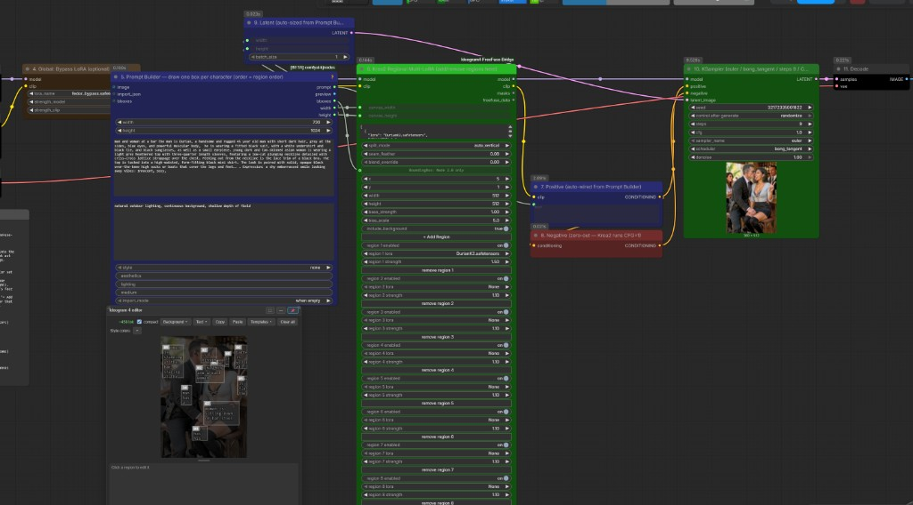

# ComfyUI Krea2 Regional Multi-LoRA — By Fedor

**Put multiple character LoRAs in one image — each one locked to its own box. Plus full bounding-box layout control for objects and any non-LoRA element.**

Draw a box for each character, assign a LoRA to each box, and this node guarantees that LoRA A only affects region A and LoRA B only affects region B. No bleed, no merged faces, no averaging. Works with two characters, three, four — as many as you want to draw boxes for.

And it isn't just for LoRAs: paired with the Ideogram 4-style prompt builder, you get **per-box control over everything else in the scene too** — objects, props, backgrounds, secondary subjects. Krea 2 responds to those positional box prompts the same way Ideogram 4 does, so you can lay out an entire composition by drawing and describing boxes, then drop character LoRAs into whichever boxes need a specific identity.



---

## NEW in v3 — Reference Lock: per-region reference images

### Why v3 exists

v1 solved **spatial bleeding**: two LoRAs in the same generation influencing each other's tokens. The masking guarantees LoRA A stays in box A. But that left a second, different problem on the table: **identity drift**. A LoRA gives you the *distribution* of a character, not a fixed likeness — run 20 seeds and the face wanders; generate a series of shots and shot 12 doesn't quite match shot 1. Perfect spatial isolation in every frame, and still no anchor holding the identity *constant* across generations.

Those are orthogonal problems, and the community discussion around v1 made that sharp: bounding boxes prevent bleed *within* an image; nothing prevented drift *across* images. The natural fix — feed the model reference images — isn't possible on Krea 2 natively: its DiT consumes a strict `[text | image]` token sequence and discards reference latents entirely. There is no slot to attend to.

So v3 adds the anchor at the only layer that allows it: the sampler. Think of it like a sculptor's mold — the reference image is cast into latent space, and every denoising step checks the in-progress latent against the mold inside the box and nudges it closer until the likeness sets. Combined with the v1 masking, each region now has both guarantees: **the LoRA can't leave its box, and the identity inside the box can't drift from its reference.**

### What it does

**v3 adds a second engine to the same node: every region row can now carry a reference image alongside its LoRA.** Click the "load ref image" button on any row, pick a file, and a thumbnail appears inline on the node — you can see at a glance exactly which image each LoRA is anchored to. During sampling, each reference actively steers its box's in-progress latent toward that image, on top of the LoRA masking.

**v3 changelog:**

- **New node: `Krea2 Regional Multi-LoRA v3 + Ref Lock`.** One node does both jobs: hard per-box LoRA masking (the v1 engine, unchanged) + per-box reference-image guidance (new).
- **Per-row reference upload with inline thumbnails.** Each region row gets a "load ref image" button; the image uploads into ComfyUI's input folder and renders as a thumbnail directly on the node. Click the thumbnail to replace, click ✕ to clear. Filenames are stored in `regions_json`, so workflows round-trip through save/load and the API.
- **Latent-mold guidance ("Reference Lock").** The reference is VAE-encoded once, resized into its box on the latent grid, and used as a "mold": at every sampling step inside a scheduled window, the model's predicted-clean latent is pulled toward the mold inside the box. Identity converges early; the model spends the remaining steps integrating lighting, seams, and context.
- **Ref-only regions.** A row with a reference image but no LoRA still works — the box is molded toward the image with no LoRA involved. Useful for props, backgrounds, or characters you have images of but no trained LoRA for.
- **Scheduled guidance window.** `ref_start_percent` / `ref_end_percent` control when the steering is active (default 0 → 0.6: lock structure early, release late).
- **New optional `vae` input** (needed to encode references). No VAE wired = LoRA-only, exactly like v1. `ref_strength 0` also fully disables the reference engine.
- v1 and v2 nodes are untouched and still registered — old workflows keep working unmodified.

### How Reference Lock works (technical)

Krea 2 has **no native reference-image pathway** — its DiT consumes a strict `[text | image]` token sequence and discards `reference_latents` (it's a pure text-to-image model). So v3 intervenes one layer up, at the **sampler**, which is model-agnostic:

1. Each reference image is encoded through the VAE into latent space, converted with `process_latent_in` into the model's processing space, and bilinearly fitted into its bounding box on the latent grid. That's the **mold**.
2. A **post-CFG hook** (`set_model_sampler_post_cfg_function`) runs after every denoising step. ComfyUI hands it the model's predicted-clean latent (`denoised` / x0). Inside the guidance window, for each region:

```
denoised = denoised + ref_strength * mask * (mold - denoised)
```

3. `mask` is the same feathered box mask family as the LoRA engine, built on the latent grid. Outside the box the correction is zero; inside, the latent moves a fixed fraction of the remaining distance toward the mold **every step**, so the region converges geometrically while staying on the sampler's trajectory.
4. The window is converted from percents to **sigma space** (`percent_to_sigma`), so it tracks the actual noise schedule rather than step indices — correct at any step count.

Because this happens post-CFG at the sampler level, it composes cleanly with the LoRA engine (which lives inside the model forward as masked activation deltas): two different intervention points, no interference. It never touches model weights, so it stays **fp8-safe**, and it works at Krea 2's native **CFG 1**.

**Knobs and behavior:**

| Knob | Default | What it does |
|------|---------|--------------|
| `ref_strength` | 0.30 | Per-step pull. 0.2–0.4 anchors identity while integrating with the scene; 0.7+ approaches a paste. 0 = off. |
| `ref_start_percent` / `ref_end_percent` | 0.0 / 0.60 | Guidance window. Ending ~0.5–0.7 locks identity early and releases the model to blend. Shorter window = looser pose copy. |
| `ref_feather` | 0.06 | Soft edge of the guidance mask. |

**Honest caveat:** latent-mold guidance anchors *composition and identity together* — the box inherits the reference's pose and framing, not just the face. Crop references to face/torso if you want identity without a full-pose lock, or end the window earlier (`ref_end_percent 0.4`).

The v3 example workflow is at `example_workflows/krea2_regional_multilora_v3.json`.

---

## Recent fixes

**LoKr (Kronecker) LoRA support.** Newer training runs (e.g. recent ai-toolkit
builds) can output **LoKr** files, which store Kronecker factors
(`lokr_w1` / `lokr_w2`) instead of the usual `lora_A` / `lora_B` pairs. The
loader previously recognized only the A/B form, so a LoKr file matched **0
layers and silently did nothing** — the LoRA appeared "not to work" even though
everything loaded without error. The loader now parses LoKr factors (direct or
`a @ b`-decomposed; tucker/conv variants are skipped) and the forward hook
applies `kron(w1, w2) · x` efficiently via grouped linears — the same identity
ComfyUI's own LoKr adapter uses, verified numerically against the materialized
Kronecker product (max error ~3e-7) across every layer geometry, including the
asymmetric attention projections. Standard LoRAs are unaffected. If a file has
neither A/B nor LoKr pairs (e.g. a raw-diff safety-bypass file), it's still
skipped with a clear warning — those belong in a normal LoRA loader.

**Reliable box → region-row sync.** When a bounding-box builder is wired in, the
region rows now track box creation/deletion reliably, including deleting the
last box (which previously left a stale row). The sync reads the builder's live
box array instead of its serialized string (which lags edits and goes empty at
zero boxes), re-checks on mouse-up and Delete/Backspace so edits register even
when this node isn't the one being redrawn, and guards against clearing your
rows during workflow load before the builder has restored its boxes.

---

## The Problem

If you've tried loading two character LoRAs at once with a normal LoRA loader, you already know what happens: the two identities smear into each other. You ask for "Alice on the left, Bob on the right" and you get one person who's a 50/50 blend of both, in both spots.

That's because a normal LoRA applies **everywhere, uniformly**. The model has no instruction to keep Alice's weights on the left. Soft tricks — attention bias, prompt engineering, CFG tweaks — reduce the smearing but never fully stop it, because the model is still *allowed* to route either LoRA anywhere.

This node removes the permission entirely.

---

## How It Works

Every LoRA is, mathematically, a small correction added to the model's internal activations. For an input `x` at a given layer, the LoRA computes:

```
delta = (x @ down.T @ up.T) * scale
output = output + delta
```

Normally that `delta` is added to **every token** — every patch of the image, everywhere. This node intercepts that step and multiplies the delta by a **spatial mask** before it's added back:

```
output = output + mask * delta
```

The mask is built from the bounding box you drew. Inside the box it's `1`; outside it's `0`. So for any image token that lands outside the box:

```
output = output + (0 * delta) = output   ← LoRA does nothing
```

There is no mathematical path for the LoRA to affect anything outside its region. It's not discouraged from leaking — it is structurally incapable of it.

**Key details:**

- The mask is built at generation time from the **actual latent token grid**, so it scales correctly to whatever resolution you're generating at.
- Text tokens are always skipped (they have no spatial position) — the mask only applies to image tokens.
- LoRA matrices are loaded raw and matched to the live model layers by name, so it works on **fp8 / quantized Krea 2 checkpoints** without touching the quantized weights.
- Multiple LoRAs are injected in the same forward pass, each with its own mask. They run in parallel, not chained.
- `seam_feather` applies a soft sigmoid edge to the box boundary so you don't get a hard pixel-cut seam between regions.

---

## Features

- **Unlimited regions.** Two characters or ten — add a row per character. No code changes, no fixed slots.
- **Bounding-box control for non-LoRA elements too.** Objects, props, backgrounds, extra people — anything you can describe. Draw a box, describe it, and Krea 2 places it there, exactly like Ideogram 4's bounding-box prompting. LoRAs and plain object boxes coexist in the same layout.
- **Auto-syncing rows.** Wire a bounding-box builder into the node and the region rows appear and disappear automatically as you draw or delete boxes. Your LoRA picks are preserved when the count changes.
- **Hard spatial masking.** Activation-delta injection, not attention bias. LoRAs cannot cross their box boundary.
- **fp8-safe.** Never modifies quantized model weights; injects at forward time.
- **CLIP passes through untouched.** The regional effect is UNet-side, exactly where identity lives.

## Full Layout Control — Not Just LoRAs

The bounding boxes drive two independent things at once:

1. **Layout / content (every box).** Each box you draw in the prompt builder carries a description, and those descriptions become a positional prompt fed to Krea 2's Qwen3-VL text encoder — the same natural, on-distribution format Ideogram 4 was built around. That means a box doesn't *have* to be a character LoRA. It can be "a wooden table," "a neon sign in the background," "a dog sitting on the left." Krea 2 honors the placement.
2. **Identity (LoRA boxes only).** For any box you also assign a LoRA to, this node hard-masks that LoRA's effect to the box on top of the layout prompt — locking in a specific trained identity where the prompt alone can't.

So the workflow is a single, unified layout tool: sketch the whole scene as boxes, describe each one, and reinforce the boxes that need a precise identity with a LoRA. Objects and characters, all placed by the same boxes, responding the way Ideogram 4 bounding-box prompts do.

---

## Installation

```bash
cd ComfyUI/custom_nodes
git clone https://github.com/CliffNodes/Krea2-Multi-Character-Lora-Node-w-bounding-box-By-Fedor.git
```

Restart ComfyUI. The nodes appear under the `Krea2/By Fedor` category:

- **Krea2 Regional Multi-LoRA** — v1, LoRA masking only (stable).
- **Krea2 Regional Multi-LoRA v3 + Ref Lock** — LoRA masking + per-region reference images (recommended).
- **Krea2 Reference Lock / Reference Lock — Multi** — standalone reference steering (v2, for custom wiring).

**Requirements:**
- ComfyUI with Krea 2 support (a recent `master` build — needs the `Krea2` model class and `krea2_to_diffusers` LoRA key map).
- Python packages: `torch`, `safetensors` (already present in any ComfyUI install).
- No other custom-node dependencies. This node is fully standalone.

The example workflow additionally uses `Ideogram4PromptBuilderKJ` from [ComfyUI-KJNodes](https://github.com/kijai/ComfyUI-KJNodes) as the box-drawing canvas. Any node that outputs a `BOUNDING_BOX` will work; KJNodes is just the one the example is wired for.

---

## Required Models

All from the Krea 2 release:

| Loader | File |
|--------|------|
| UNETLoader | `krea2_turbo_bf16.safetensors` (or `krea2_bf16.safetensors`) |
| CLIPLoader (type `krea2`) | `qwen3vl_4b_bf16.safetensors` |
| VAELoader | `qwen_image_vae.safetensors` |

Your **character LoRAs must be trained against Krea 2**. The reference trainer is [ai-toolkit](https://github.com/ostris/ai-toolkit). FLUX or Ideogram LoRAs will load without erroring but produce poor likeness — the attention dimensions don't line up.

---

## How to Use

The example workflow (`example_workflows/krea2_regional_multilora.json`) wires everything up. The flow is:

```
UNETLoader ─┐
CLIPLoader ─┤─► (optional global LoRA) ─► Krea2RegionalMultiLoRA ─► KSampler ─► VAEDecode ─► SaveImage
VAELoader ──┘                                     ▲
                                                  │
                     Ideogram4PromptBuilderKJ ────┘
                     (scene prompt + one box per character)
```

**Step by step:**

1. **Write your scene prompt** in the box builder. Describe the overall composition — setting, lighting, camera — *not* the individual characters. Example: *"two people standing together at an outdoor cafe, golden hour, 50mm."*

2. **Draw one box per character**, in order (left to right is the natural convention). Each box should cover roughly where that person's face and upper body will land. As you draw, **rows appear automatically** in the Krea2 node.

3. **Assign a LoRA to each row** in the Krea2 node. Row 1 → box 1, row 2 → box 2, and so on. Set each row's strength to **1.5 or higher** — a masked regional LoRA needs more push than a normal full-image LoRA (see [Key Recommendations](#key-recommendations)).

4. **Sampler settings** for Krea 2 Turbo: `euler` / `bong_tangent` / 8–12 steps / **CFG 1.0**. The negative conditioning is zeroed out — Krea 2 is designed to run at CFG 1.

5. **Queue.**

---

## Key Recommendations

The settings that make the biggest difference in practice:

- **LoRA strength: 1.5 or higher.** A regional LoRA is masked to a fraction of the image and has to establish a full identity in that smaller area, so it needs more push than a normal full-image LoRA. Start each row at **1.5** and go up if the likeness is weak. The usual global-LoRA range (~1.0) tends to look washed out once it's masked.
- **Match `canvas_width` / `canvas_height` across the prompt builder (node 5) and this node (node 6).** Boxes are stored in the builder's pixel space and re-normalized against this node's canvas size. If the two don't match, every box lands in the wrong place and the masks drift off your subjects. In the example workflow they're wired together for exactly this reason — keep them wired, or set both to the same values (and to your actual generation resolution).
- **Keep `split_mode` on `bbox` when you're drawing boxes.** `auto_vertical` / `auto_horizontal` ignore your boxes and just cut the canvas into equal strips — fine for a quick test, but they won't follow anything you drew.
- **Region order = box order.** Row 1 pairs with the first box, row 2 with the second, and so on. If a character comes out generic, it's almost always a mismatched order.
- **Boxes should cover each character's face/upper body, and not overlap.** Leave a small gap between boxes (or a little `seam_feather`) so the identities stay cleanly separated.
- **Reference images (v3): `ref_strength` 0.2–0.4, window 0 → ~0.6.** Enough to lock identity early without copying the reference's exact pose. Crop refs to the face if you want likeness without the framing.

---

## Node Inputs

| Input | Notes |
|-------|-------|
| `model` / `clip` | From your loaders (or a global LoRA loader first). |
| `canvas_width` / `canvas_height` | Used to re-normalize the pixel-space boxes. **Must match the prompt builder's width/height** or the masks land in the wrong place — wire them straight from the builder (as in the example). |
| `regions_json` | The source of truth for the region list. The `+ Add Region` / `remove` buttons and box auto-sync edit this for you — you rarely touch it directly. |
| `split_mode` | `bbox` = use the drawn boxes (default). `auto_vertical` / `auto_horizontal` = split the canvas into equal strips, no boxes needed. |
| `seam_feather` | Edge softness (fraction of the token grid). `0.08` default. Raise toward `0.15` if you see hard seams. |
| `blend_override` | Keep at `0` for clean separation. Raising it mixes all LoRAs across the whole image; identities collapse past ~0.5. |
| `bboxes` (optional) | The `BOUNDING_BOX` wire from your box builder. |
| `base_strength` (optional) | Global multiplier over every region's strength. |

**Outputs:** `model` and `clip` (wire model → KSampler). The `masks` / `data` outputs are debug/preview payloads and can be left unconnected.

---

## Troubleshooting

**Characters still look merged**
Your boxes probably overlap. Shrink them so there's a clear gap. You can also lower `seam_feather` to tighten the boundaries.

**Node logs "region N matched 0 layers"**
That LoRA's key format doesn't map onto Krea 2 — it was almost certainly trained on a different model family (FLUX, SDXL, etc.). Use Krea 2 LoRAs.

**One character is right, the other is generic**
The row order doesn't match the box order. Row 1 always pairs with the first box drawn. Re-check the ordering in the box builder.

**Hard seam between regions**
Raise `seam_feather` to `0.12`–`0.15`, or overlap the boxes slightly (5–10% of canvas width) so there's a small blend zone.

**One LoRA dominates**
Equalize strengths, and check box sizes — a box twice as large gives that LoRA twice the spatial footprint even at equal strength.

---

## How It Differs From Attention-Bias Approaches

Some regional-LoRA tools steer identities using an **attention bias** — they add a penalty that *discourages* a LoRA's tokens from attending outside their region. It's a statistical nudge; the model can still route around it, which is why you get partial bleed.

This node uses **activation-delta masking** instead. The LoRA's contribution is multiplied by zero outside its box, at the point where it's added to the activations. There's nothing to route around — the contribution is gone. That's the difference between "please stay in your box" and "you cannot leave your box."

---

## License

MIT. See `LICENSE`.

## Credits

- **Node by Fedor.**
- Built on ComfyUI's model-wrapper / forward-hook system.
- Example workflow uses [`Ideogram4PromptBuilderKJ`](https://github.com/kijai/ComfyUI-KJNodes) by kijai for the box-drawing canvas.
- Krea 2 by Krea. Character LoRA training via [ai-toolkit](https://github.com/ostris/ai-toolkit) by ostris.
